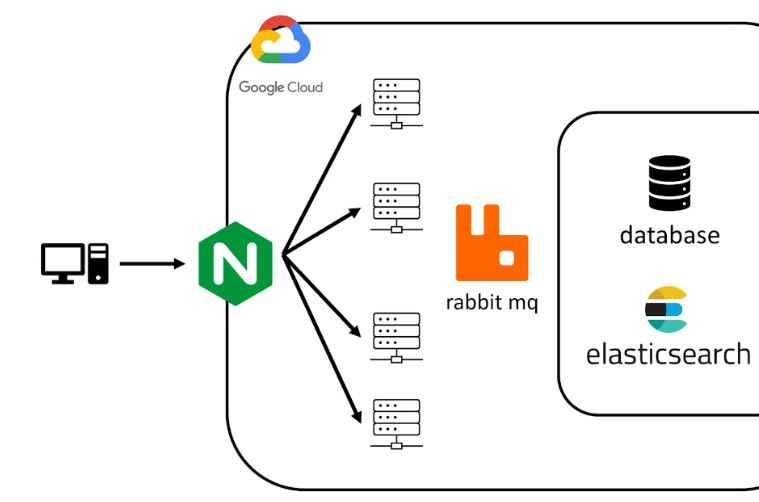

# To-Do-List

   
  
   

## 프로젝트 소개

  ### To-do-list로 오늘 할일을 기록하고, 할일의 내부단계 스텝을 추가하고, 간단한 메모도 작성할수 있습니다.

  
  

 

## 기술 스택

| SpringBoot | MySQL |  Spring data JPA   |  PostMan   | Docker | ElasticSearch | RabbitMQ | Nginx | Google Cloud Platform | 
| :--------: | :--------: | :--------: | :--------: | :--------: | :--------: | :--------: | :--------: | :--------: |
|   ![sb]    |   ![my]    |   ![dj]    |   ![pos]    |   ![dc]    |   ![es]    |   ![ra]    |   ![ng]    |   ![gc]    |       

| GitHub Webhook | jenkins |
| :--------: | :--------: |
|   ![gw]    |   ![jk]    |

 

## 구현 기능

### 오늘 할일 main step 작성 

 
### 작성된 main step 내부에 sub step으로 단계를 기록할수 있습니다.

### 간단한 memo들도 추가할수 있습니다.

 

## 배운 점.
 ### RabbitMQ 와 ElasticSearch 등을 도입해서 프로젝트의 성능을 개선할수 있었습니다.
 ### Google Cloud Platform 사용으로, vm 인스턴스의 이해 -> 그에 기반되는 Linux 명령어 인지
 ### Docker를 통한 "코드형 인프라"의 개념 -> image를 통해 쉽게 인프라 구축이 가능합니다.
 ### nginx를 통한 리버스 프록시 도입 및 로드밸런싱환경을 구축했습니다.
 ### GitHub Webhook을 통한 Jenkins 자동 빌드,배포 파이프라인 구축
 
 

## 느낀점.
  ### 이제 코드, 프레임워크 적인 부분보다 기술을 도입한다는점에 많이 주목했던 이번 프로젝트입니다.
  ### RabbitMq(메시지큐), elasticSearch(검색엔진) 도입을 통해 성능개선을 시도했습니다.
  ### 그리고 클라우드 서비스를 통해서 VM인스턴스를 띄워서 애플리케이션을 빌드하고 배포해보았습니다.
  ### nginx를 사용하면서 리버스 프록시 개념과 로드 밸런싱에 대해 숙지하였습니다.
  ### 마지막 아쉬운점으로는 Jenkins를 통해서 배포스크립트를 작성할때 java로 진행했는데, 다음에는 도커를 통해서 코드형 인프라를 잘 구축해보려고합니다.
  

 

## 라이센스

MIT &copy; [NoHack](mailto:lbjp114@gmail.com)

<!-- Stack Icon Refernces -->

[sb]: /images/stack/springboot.svg
[my]: /images/stack/mysql.svg
[dj]: /images/stack/datajpa.svg
[pos]: /images/stack/postman.svg
[jm]: /images/stack/apachejmeter.svg
[dc]: /images/stack/docker.svg
[es]: /images/stack/elasticsearch.svg
[gc]: /images/stack/gcp.svg
[ng]: /images/stack/nginx.svg
[ra]: /images/stack/rabbitmq.svg
[gw]: /images/stack/github.svg
[jk]: /images/stack/jenkins-svgrepo-com.svg

